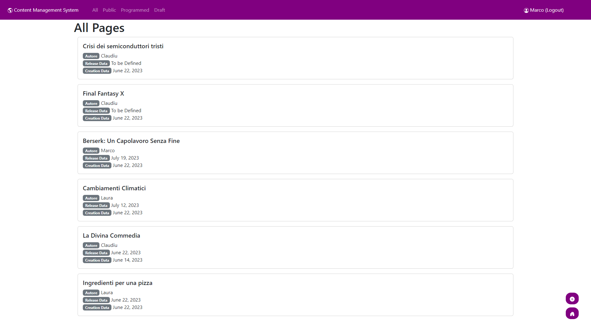
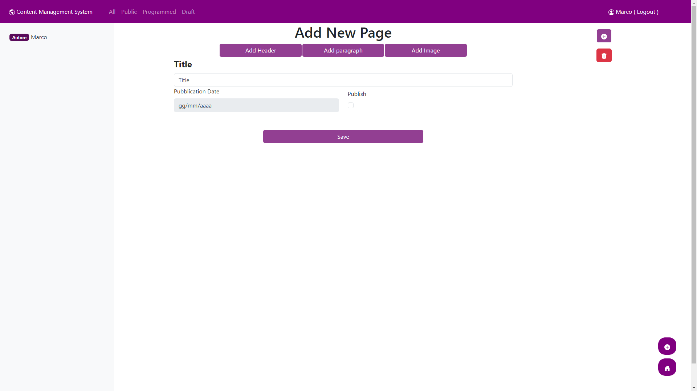

# Exam #1: "CMSmall"
## Student: s317661 TCACIUC CLAUDIU CONSTANTIN 

## React Client Application Routes

- Route `/`: main page, with the list of all public pages
- Route `/login`: login page
- Route `/:filter`: main page when logged in
  - params: allpages, publicpages, progpages, draftpages
- Route `/page/:id`: page view
  - params: the id of the page in the db
- Route `/edit_page/:id`: edit page for an existing one
  - params: the id of the page in the db
- Route `/add_page`: add a new page
- Route `*`: default route, for page not found that redirects to `/`

## API Server

### Autentication API

- POST `/api/session`
  - request body content: `{ username: "aaa", password: "ddd" }`
  - response body content: `{ id: 123, name: "bbb", username: "ccc", isAdmin: true|false }`
- DELETE `/api/session/current`
  - request body content: (empty)
  - response body content: (empty)
- GET `/api/session/current`
  - request body content: (empty)
  - response body content: `{ id: 123, name: "bbb", username: "ccc", isAdmin: true|false }`

### Pages API Authenticated

- GET `/api/:filter`
  - request body content: credentials, filter(allpages, publicpages, progpages, draftpages)
  - response body content: `[ { id: 123, title: "page title", author_id: 321, author: "aaa", publication_date: "2023-06-22 | Draft"}, ... ]`
- PUT `/api/changeappname`
  - request body content: credentials, `{ application_name: "CMSmall" }`
  - response body content: `App name changed`
- POST `/api/add_page`
  - request body content: credentials, `{ title: "page title", author_id: 321, author: { id: 123, name: "bbb", username: "ccc", isAdmin: true|false }, publication_date: "2023-06-22 | Draft"}, blocks: [{ id: "aaa", type: 123, content:"aaabbb", order_index: 123 }, ...] }` note: the block id is only for the creation of the page, it will be changed by the server 
  - response body content: `{ id: 123 }`
- DELETE `/api/delete_page/:id`
  - request body content: credentials, page id
  - response body content: `{ message: "Page deleted" }`
- POST `/api/add_block:id`
  - request body content: credentials, page id, `{ id: "aaa", type: 123, content:"aaabbb", order_index: 123 }`
  - response body content: `{ id: 123 }`
- PUT `/api/edit_block:id`
  - request body content: credentials, page id, `{ id: "aaa", type: 123, content:"aaabbb", order_index: 123 }`
  - response body content: `{ id: 123 }`
- DELETE `/api/delete_block:id`
  - request body content: credentials, block id
  - response body content: `{ message: "Block deleted" }`
- PUT `/api/update_block_order`
  - request body content: credentials, `{ page_info: { id: 123, title: "page title", author_id: 321, author: "aaa", publication_date: "2023-06-22 | Draft"}, content: [{ block_id: 123, block_type: 123, content:"aaabbb", order_index: 123, page_id: 321 }, ...] }`
  - response body content: `{ message: "Block order updated successfully" }`
- PUT `/api/update_image/:id`
  - request body content: credentials, block_id, `{ image_path: "aaaa.jpg" }`
  - response body content: `{ message: "Image updated" }`
- DELETE `/api/clean_page/:id`
  - request body content: credentials, page id
  - response body content: `{ message: "Page cleaned" }`
- PUT `/api/update_date/:id`
  - request body content: credentials, page id, `2023-06-22 | Draft`
  - response body content: `{ message: "Date updated" }`
- GET `/api/users`
  - request body content: credentials
  - response body content: `[ { id: 123, name: "bbb", username: "ccc", isAdmin: true|false }, ... ]`
- PUT `/api/change_page_user/:id`
  - request body content: credentials, user id, `{ user_id: 123 }`
  - response body content: `{ message: "Author updated" }`
- PUT `/api/update_title/:id`
  - request body content: credentials, page id, `{ title: "page title" }`
  - response body content: `{ message: "Title updated" }`

### Pages API Unauthenticated

- GET `/api/appname`
  - request body content: (empty)
  - response body content: `{ appname: "CMSmall" }`
- GET `/api/page/:id`
  - request body content: page id
  - response body content: `{ page_info: { id: 123, title: "page title", author_id: 321, author: "aaa", publication_date: "2023-06-22 | Draft"}, content: [{ block_id: 123, block_type: 123, content:"aaabbb", order_index: 123, page_id: 321 }, ...] }`
- GET `/api/images/`
  - request body content: (empty)
  - response body content: `[ { image_id: 123, image_path: "aaaa.jpg" }, ... ]`

## Database Tables

- Table `Users` - contains: (id, name, email, salt, hash, isAdmin)
- Table `Pages` - contains: (page_id, title, author_id, creation_date, publication_date)
- Table `ContentBlocks` - contains: (block_id, page_id, block_type, content, order_index)
- Table `Images` - contains: (image_id, path)

## Main React Components

- `My_Main` (in `My_Main.jsx`): it contains the main view of all the pages if the user is logged in, otherwise it shows only the public pages
- `My_Page` (in `My_Page.jsx`): it contains the view of a single page. If the user is logged in and is the author or an admin, it shows the edit button and the delete button, otherwise it shows only the page
- `My_Edit_Page` (in `My_Edit_Page.jsx`): it contains the view of a single page in edit mode. It's accessible only if the user is logged in and is the author or an admin. In this page the user can change the title, add, edit, move and delete blocks, change the publication date and the author of the page, it also clean the page from all the empty blocks when the user saves the page
- `My_Add_Page` (in `My_Add_Page.jsx`): it contains the view for adding a new page. It's accessible only if the user is logged in, it allows the user to add a new page with a title and a publication date that can also be set to draft
- `My_Login` (in `My_Login.jsx`): it contains the view for the login page. It allows the user to login with email and password
- `My_Header` (in `My_Header.jsx`): it contains the header of the application. It shows the app name and the login button if the user is not logged in, otherwise it shows the logout button, the app name with a button to change the app name if the user is also an admin and the filter for the back-office pages (pages that are not published yet). Pressing the app name also allows the user to be redirected to the home page
- `My_Footer` (in `My_Footer.jsx`): it contains the footer of the application. It shows the button to add a new page if the user is logged in and the home button, otherwise it shows only the home button
- `ContentTypeView` (in `ContentTypeView.jsx`): it contains the view of a single content
block. It's a sub component of `My_Edit_Page` and it contains the Row component that allows the user to edit the content of the block

## Screenshot

## Users Credentials

- username: `claudiu@polito.it`, password: `password` (admin)
- username: `marco@polito.it`, password: `password`
- username: `giacomo@polito.it`, password: `password`
- username: `sara@polito.it`, password: `password` (admin)
- username: `laura@polito.it`, password: `password`
